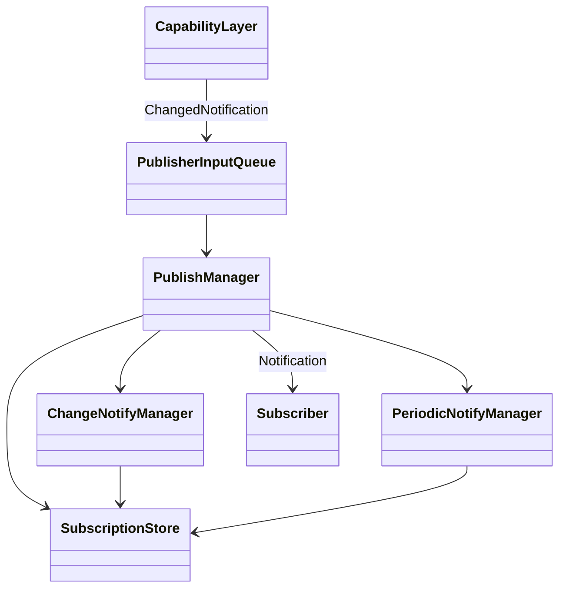
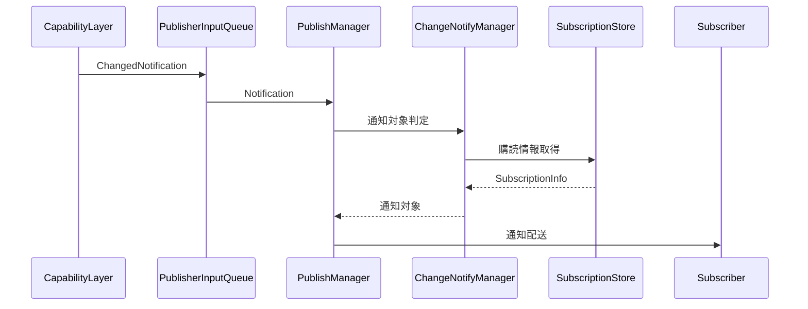
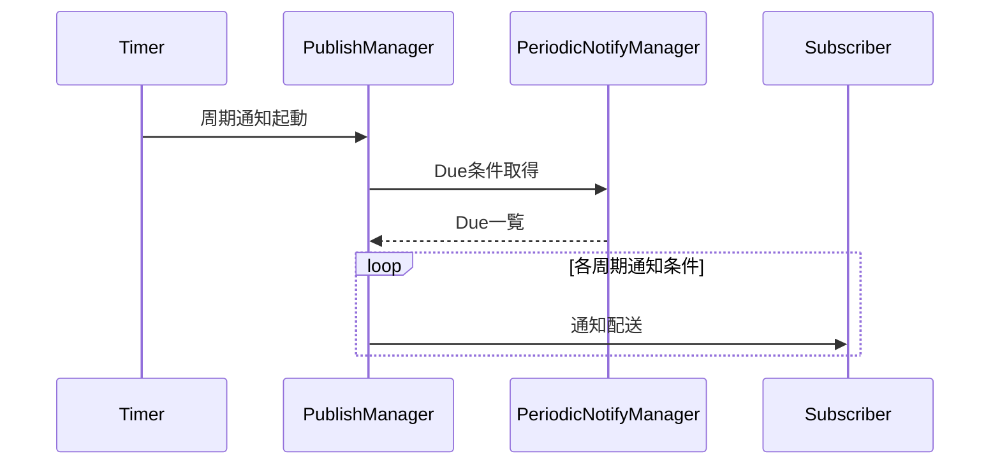
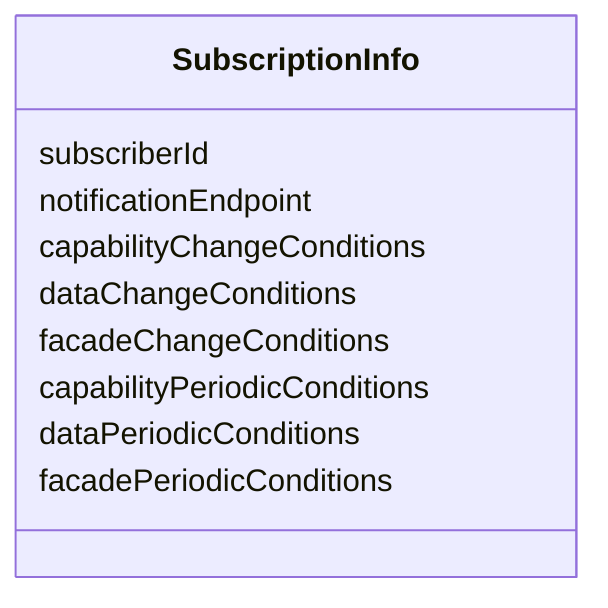
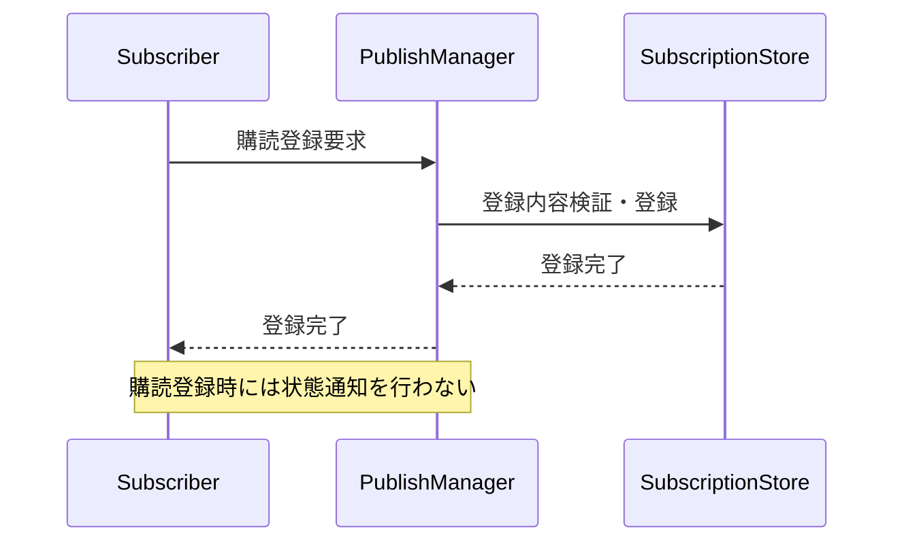
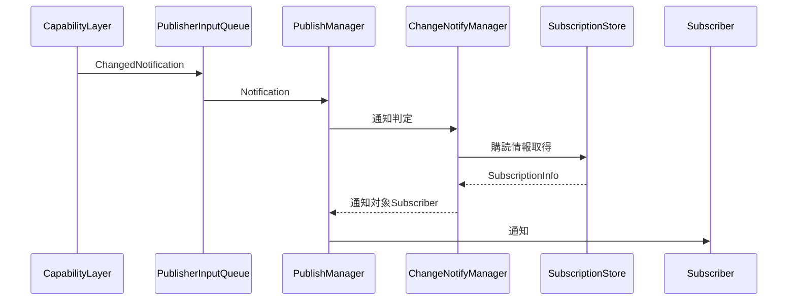
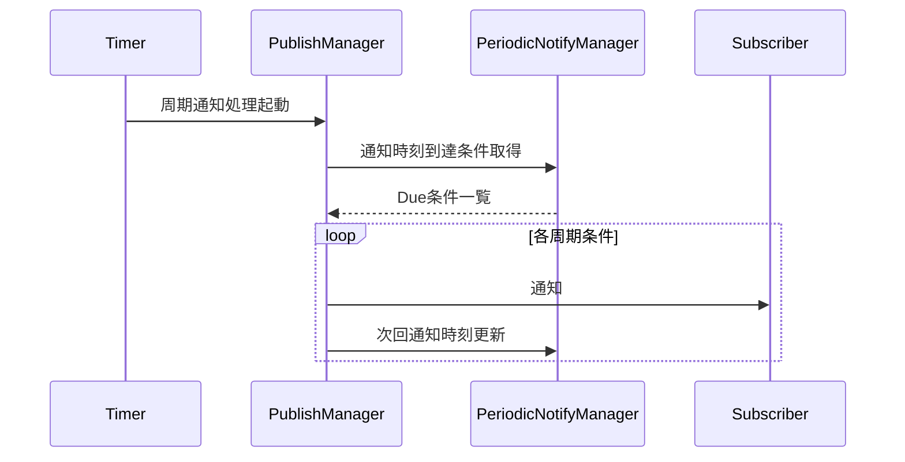
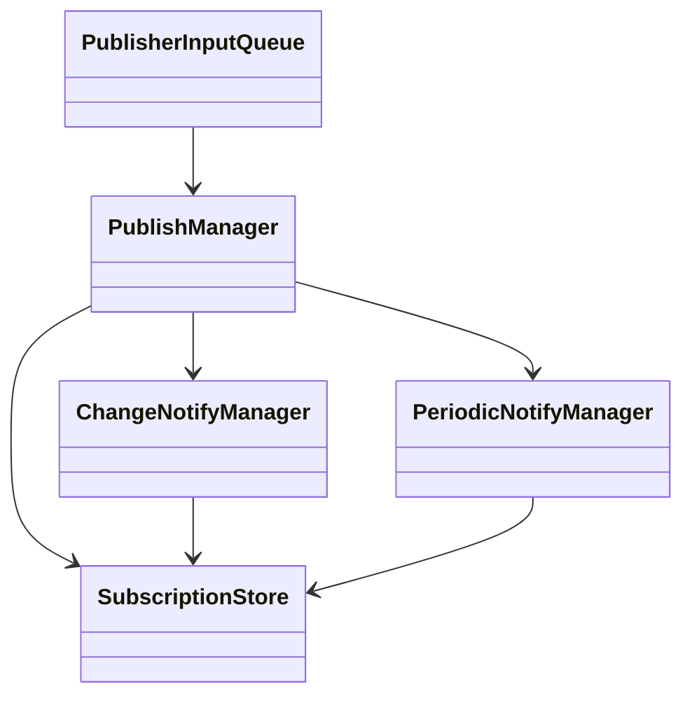

# 1. 表紙

| 項目 | 内容 |
|--------|--------|
| ドキュメント名 | Publisher Layer モジュール仕様書 |
| バージョン | Draft 0.04 |
| レイヤ | Publisher Layer |
| 対象機種 | T.B.D |
| 作成 | ブラザー工業 システムプロセス開発部 開発3G |

# 2. 更新履歴

| バージョン | 更新日 | 更新者 | 内容 |
|------------|------------|------------|------------|
| 0.04 | T.B.D | 波多野 匡寛 | レビュー反映版 |

# 3. 目次

1. 表紙
2. 更新履歴
3. 目次
4. 概要
5. 用語集
6. 関連ドキュメント
7. 制約事項
8. 他のモジュールとの接続
9. 機能概要
10. IF仕様
11. コンフィグレーション仕様
12. 呼び出しシーケンス
13. 組み込み手順
14. 排他・整合性設計

# 4. 概要

## 4.1 本ドキュメントの目的

本ドキュメントは、Publisher Layer の仕様を規定することを目的とする。

Publisher Layer は、Capability Layer から通知される変更通知を受理し、Subscriber が登録した購読条件に基づいて通知対象を判定し、更新通知を配送する。

対象範囲:
- DataChangedNotification の受付
- CapabilityChangedNotification の受付
- FacadeChangedNotification の受付
- Subscriber の購読登録受付
- 購読情報管理
- 変更通知判定
- 周期通知判定
- Subscriber への通知配送

## 4.2 本ドキュメントの読み手

- Capability Layer 設計者
- Subscriber 設計者
- システム統合担当者
- 購読条件定義保守担当者

## 4.3 本モジュールの位置づけ

Publisher Layer は、Capability Layer の後段に配置される通知配送 Layer である。

本モジュールは以下を実施する。

1. Capability Layer から変更通知を受信する。
2. 購読条件と変更内容を照合する。
3. 通知対象 Subscriber を判定する。
4. Subscriber へ通知を配送する。
5. 周期通知条件を管理する。

入力:
- Capability Layer からの変更通知

出力:
- Subscriber への通知

責務境界は以下とする。

- 変更内容の判定は Capability Layer の責務とする。
- 通知対象判定は Publisher Layer の責務とする。
- 状態データ取得は Subscriber の責務とする。
- Publisher Layer は Capability、Data、Facade の実体を保持しない。
- Publisher Layer は状態データを取得しない。

# 5. 用語集

## 5.1 制御階層に関する用語

| 用語 | 定義 |
|------|------|
| Subscriber | Publisher Layer が提供する通知を利用するコンポーネントまたは機能単位 |
| Subscription | Subscriber が登録する購読契約 |
| SubscriptionInfo | Subscriber識別情報、通知先、変更通知条件、周期通知条件を保持する購読情報 |
| SubscriptionRequest | Subscriberからの購読登録要求、または保持される購読設定情報 |
| Subscriber識別情報 | Subscriber を一意に識別する情報 |

## 5.2 設計原則に関する用語

| 用語 | 定義 |
|------|------|
| 変更通知 | 変更を契機として行われる通知 |
| 周期通知 | 周期条件に従って実施される通知 |
| Category一致判定 | 変更内容と購読条件を比較する判定処理 |
| 非同期通知 | 通知受付と通知配送を分離する通知方式 |
| 通知配送 | Subscriber へ通知を送信する処理 |

## 5.3 モジュール固有用語

| 用語 | 定義 |
|------|------|
| CapabilityCategory | Capability を論理的に分類したカテゴリ |
| DataChangedNotification | Data 更新通知 |
| CapabilityChangedNotification | Capability 更新通知 |
| FacadeChangedNotification | Facade 更新通知 |
| Capability変更通知条件 | Capability変更時の通知条件 |
| Data変更通知条件 | Data変更時の通知条件 |
| Facade変更通知条件 | Facade変更時の通知条件 |
| Capability周期通知条件 | Capability周期通知条件 |
| Data周期通知条件 | Data周期通知条件 |
| Facade周期通知条件 | Facade周期通知条件 |
| PeriodicCondition | 周期設定ID、通知対象種別、通知対象、通知周期、次回通知時刻を保持する管理単位 |
| 通知優先度 | 通知制御に用いる優先度情報 |
| 最小通知間隔 | 通知集中を防止するための通知抑制期間 |
| 通知対象種別 | Capability、Data、Facade を識別する種別情報 |
| Facade | Facade通知対象となる公開機能単位 |

## 5.4 上位・下位レイヤに関する用語

| 用語 | 定義 |
|------|------|
| Capability Layer | 本モジュールへ変更通知を送信するレイヤ |
| Subscriber | 通知利用側コンポーネント |
| Publisher Layer | 購読管理および通知配送を担うレイヤ |

## 5.5 モジュール構成区分に関する用語

| 用語 | 定義 |
|------|------|
| PublishManager | Publisher Layer 全体を制御する管理コンポーネント |
| ChangeNotifyManager | 変更通知判定を行う管理コンポーネント |
| SubscriptionStore | 購読情報を管理するコンポーネント |
| PeriodicNotifyManager | 周期通知条件を管理するコンポーネント |
| PublisherInputQueue | 変更通知を受け渡すキュー |

# 6. 関連ドキュメント

| # | 文書名 | 版 | 備考 |
|---|---|---|---|
| 1 | Capability Layer 仕様書 | T.B.D | 変更通知定義元 |
# 7. 制約事項

## 7.1 機能制約

Publisher Layer は以下の機能制約のもと動作する。

- Publisher Layer は DataChangedNotification を受理する。
- Publisher Layer は CapabilityChangedNotification を受理する。
- Publisher Layer は FacadeChangedNotification を受理する。
- Subscriber からの購読登録要求を受理する。
- 購読情報を管理する。
- 変更通知対象 Subscriber の判定を行う。
- 周期通知対象 Subscriber の判定を行う。
- Subscriber へ通知を配送する。
- 通知対象判定には購読条件を利用する。
- Capability 実体は通知しない。通知には変更された Category 情報のみを含める。
- Data 実体は通知しない。通知には変更された DataDomain 情報のみを含める。
- Facade 実体は通知しない。通知には変更された FacadeCategory 情報のみを含める。
- 変更通知条件と周期通知条件は独立して管理する。
- 同一対象に対して変更通知条件と周期通知条件を同時設定可能とする。
- Subscriber 登録、変更通知登録、周期通知登録を別々の操作には分離しない。
- Subscriber は Capability 通知および Data 通知を同時に購読できる。
- 購読登録を契機とした状態通知は行わない。
- Publisher Layer は Capability を保持しない。
- Publisher Layer は Data を保持しない。
- Publisher Layer は Facade を保持しない。
- Publisher Layer は状態データを保持しない。
- Publisher Layer は Subscriber の業務処理を実行しない。
- 通知失敗を検出可能とする。異常処理方式の詳細は詳細設計で定義する。

## 7.2 前提条件

Publisher Layer は以下を前提として動作する。

- Capability Layer が変更内容の判定を完了していること。
- DataChangedNotification の構造は Capability Layer で定義されていること。
- CapabilityChangedNotification の構造は Capability Layer で定義されていること。
- FacadeChangedNotification の構造は Capability Layer で定義されていること。
- Subscriber が購読登録を実施すること。
- Subscriber が通知を受信可能な通知先を提供すること。
- 購読条件で使用する Category、Domain、FacadeCategory がシステム内で定義されていること。

## 7.3 呼び出し制約

Publisher Layer の利用にあたり以下の制約を適用する。

- Capability Layer からの通知受付処理は内部 Queue への投入後に復帰する。
- 通知受付処理は通知配送完了を待たない。
- 排他制御の詳細は14章を参照。

# 8. 他のモジュールとの接続

Publisher Layer は Capability Layer から変更通知を受信し、購読条件に基づいて Subscriber へ通知を配送する。
Publisher Layer は Capability、Data、Facade の実体には依存せず、変更通知および購読情報のみを利用して通知判定を行う。

## 8.1 想定される接続先

| # | 分類 | 接続先 | 接続方式 | 接続要否 | 用途 |
|---|---|---|---|---|---|
| 1 | 入力元 | Capability Layer | 通知受付IF | 必須 | 変更通知受信 |
| 2 | 利用先 | Subscriber | 購読管理IF | 必須 | 購読登録 |
| 3 | 利用先 | Subscriber | 通知配送IF | 必須 | 変更通知および周期通知配送 |

## 8.2 接続方針

### 8.2.1 Capability Layerとの接続

- Publisher Layer は DataChangedNotification を受信する。
- Publisher Layer は CapabilityChangedNotification を受信する。
- Publisher Layer は FacadeChangedNotification を受信する。
- 変更内容の判定は Capability Layer の責務とする。
- Publisher Layer は変更通知に含まれる情報をもとに通知対象判定を行う。
- 通知構造の詳細は Capability Layer 仕様に従う。

### 8.2.2 Subscriberとの接続

- Subscriber は購読登録を行う。
- Subscriber は変更通知条件および周期通知条件を登録する。
- Publisher Layer は購読条件に一致する Subscriber へ通知を配送する。
- Subscriber は通知を契機として必要な状態取得を行う。
- Publisher Layer は Capability 実体を通知しない。
- Publisher Layer は Data 実体を通知しない。
- Publisher Layer は Facade 実体を通知しない。

### 8.2.3 依存方針

- Publisher Layer は Capability Layer からの変更通知を利用する。
- Publisher Layer は Subscriber への通知配送を行う。
- Publisher Layer は Capability、Data、Facade の実体取得に依存しない。
- Publisher Layer は Subscriber の内部処理に依存しない。
- Publisher Layer は Subscriber の起動を管理しない。
# 9. 機能概要

## 9.1 システム構造における位置づけ

Publisher Layer は Capability Layer と Subscriber の間に位置する通知配送 Layer である。

Capability Layer が生成した変更通知を受信し、購読条件および周期通知条件に基づいて通知対象を判定し、Subscriber へ通知を配送する。Publisher Layer は通知配送および購読管理を担う。Capability、Data、Facade の実体は保持しない。

### 図1. システム構造における本モジュールの位置づけ



## 9.2 内部処理モデル

Publisher Layer は通知受信を契機として動作する。

受信した変更通知から通知対象 Subscriber を判定し、通知配送を実施する。周期通知については登録された周期通知条件に従い実施する。

### 図2. 変更通知処理モデル



### 図3. 周期通知処理モデル



## 9.3 責務

### 9.3.1 変更通知受付

- DataChangedNotification受付
- CapabilityChangedNotification受付
- FacadeChangedNotification受付

### 9.3.2 購読情報管理

- 購読登録受付
- 購読情報保持
- 購読情報検索
- 通知対象となる購読情報の提供

### 9.3.3 通知対象判定

- Capability変更通知判定
- Data変更通知判定
- Facade変更通知判定

### 9.3.4 周期通知管理

- Capability周期通知条件管理
- Data周期通知条件管理
- Facade周期通知条件管理

### 9.3.5 通知配送

- Subscriber通知制御
- 変更通知配送
- 周期通知配送

## 9.4 非責務

- Capability の生成
- 変更Category の判定
- 通知優先度の判定
- Subscriber の起動
- Subscriber 内部処理
- Capability の取得
- Data の取得
- Facade の取得
- Capability の保持
- Data の保持
- Facade の保持

## 9.5 通知方針

### 9.5.1 非同期通知

- 通知受付処理は内部Queue投入後に復帰する。
- 通知配送完了待ちは行わない。

### 9.5.2 Capability変更通知

- CapabilityChangedNotification の CapabilityCategory と購読条件を比較する。
- 一致した Subscriber へ Capability 更新通知を配送する。
- 通知には変更された Category 情報のみを含める。

### 9.5.3 変更通知の最小通知間隔

- 変更通知には最小通知間隔を適用する。
- 周期通知には適用しない。
- 最小通知間隔内に複数変更が発生した場合は通知可能時点の最新状態を通知する。
- 通知優先度がクリティカルの場合は最小通知間隔を適用しないことを可能とする。

### 9.5.4 Capability周期通知

- Capability周期通知は周期通知条件に指定された周期で実施する。

### 9.5.5 Data変更通知

- DataChangedNotification の DataDomain と購読条件を比較する。
- 一致した Subscriber へ Data 更新通知を配送する。
- 通知には変更された DataDomain 情報のみを含める。

### 9.5.6 Data周期通知

- Data周期通知は周期通知条件に指定された周期で実施する。

### 9.5.7 Facade変更通知

- FacadeChangedNotification の FacadeCategory と購読条件を比較する。
- 一致した Subscriber へ Facade 更新通知を配送する。
- 通知には変更された FacadeCategory 情報のみを含める。

### 9.5.8 Facade周期通知

- Facade周期通知は周期通知条件に指定された周期で実施する。
# 10. IF仕様

## 10.1 概要

本章では Publisher Layer が利用者および接続先との間で取り扱うインターフェースおよび公開契約を示す。

具体的な関数名、引数型、戻り値およびエラーコードは詳細設計で定義する。

本章では以下を対象とする。

- 購読登録契約
- 変更通知受付契約
- 購読情報契約
- 周期通知条件契約

---

## 10.2 外部公開インターフェース一覧

| # | IF名 | 用途 | 責務 |
|---|---|---|---|
| 1 | 購読登録 | Subscriberからの購読登録受付 | 購読情報管理 |

---

## 10.3 外部利用インターフェース一覧

| IF名 | 提供元 | 利用通知 |
|---|---|---|
| 変更通知入力 | Capability Layer | DataChangedNotification / CapabilityChangedNotification / FacadeChangedNotification |

注記:

- Publisher Layer は上記3種類の変更通知を入力として利用する。
- 通知データ構造の詳細は Capability Layer 仕様書を参照する。
- 本仕様書では通知種別のみを規定し、通知構造そのものは規定しない。

---

## 10.4 外部公開型一覧

| # | 型名 | 種別 | 用途 |
|---|---|---|---|
| 1 | SubscriptionRequest | 構造体 | 購読登録要求 |
| 2 | SubscriptionInfo | 構造体 | 購読情報管理 |
| 3 | PeriodicCondition | 構造体 | 周期通知条件管理 |

---

## 10.5 外部公開型

### 10.5.1 SubscriptionRequest

| 項目 | 内容 |
|---|---|
| 種別 | 構造体 |
| 内容 | Subscriberからの購読登録要求 |
| 保持情報 | Subscriber識別情報 |
|  | Capability変更通知条件 |
|  | Data変更通知条件 |
|  | Facade変更通知条件 |
|  | Capability周期通知条件 |
|  | Data周期通知条件 |
|  | Facade周期通知条件 |

---

### 10.5.2 SubscriptionInfo

| 項目 | 内容 |
|---|---|
| 種別 | 構造体 |
| 内容 | Publisher Layerが管理する購読情報 |
| 保持情報 | Subscriber識別情報 |
|  | 通知先 |
|  | 変更通知条件 |
|  | 周期通知条件 |

---

### 10.5.3 PeriodicCondition

| 項目 | 内容 |
|---|---|
| 種別 | 構造体 |
| 内容 | 周期通知条件管理単位 |
| 保持情報 | 周期設定ID |
|  | 通知対象種別 |
|  | 通知対象 |
|  | 通知周期 |
|  | 次回通知時刻 |

---

## 10.6 外部公開機能

### 10.6.1 購読登録

| 項目 | 内容 |
|---|---|
| 機能名 | 購読登録 |
| 入力 | SubscriptionRequest |
| 戻り値 | T.B.D |
| 説明 | Subscriberの購読情報を登録する |
| 備考 | 詳細なシグネチャは詳細設計で定義する |

# 11. コンフィグレーション仕様

## 11.1 設計方針

Publisher Layer は Subscriber ごとの購読情報を SubscriptionInfo として管理する。

SubscriptionInfo には Subscriber 識別情報、通知先、変更通知条件および周期通知条件を含む。

変更通知条件と周期通知条件は独立して管理する。

同一の通知対象に対して、変更通知条件と周期通知条件を同時に設定可能とする。

---

## 11.2 コンフィグ構造

Publisher Layer で管理する設定情報の論理構造を以下に示す。



### 11.2.1 構成要素一覧

| 構成要素 | 用途 |
|-----------|-----------|
| SubscriptionInfo | Subscriber単位の購読情報管理 |

---

## 11.3 SubscriptionInfo管理

SubscriptionInfo は Subscriber ごとの購読情報を管理する設定単位である。

### 11.3.1 管理項目

| 項目 | 内容 |
|--------|--------|
| Subscriber識別情報 | Subscriber識別 |
| 通知先 | 通知配送先 |
| Capability変更通知条件 | Capability変更通知判定条件 |
| Data変更通知条件 | Data変更通知判定条件 |
| Facade変更通知条件 | Facade変更通知判定条件 |
| Capability周期通知条件 | Capability周期通知条件 |
| Data周期通知条件 | Data周期通知条件 |
| Facade周期通知条件 | Facade周期通知条件 |

### 11.3.2 保持方針

- Subscriber ごとに管理する。
- 通知対象判定で利用する。
- 周期通知対象判定で利用する。
- 変更通知条件と周期通知条件は独立して管理する。

### 11.3.3 周期通知条件管理単位

周期通知条件は PeriodicCondition を管理単位として保持する。

| 項目 | 内容 |
|--------|--------|
| 周期設定ID | 周期条件識別子 |
| 通知対象種別 | 通知対象分類 |
| 通知対象 | 通知対象識別情報 |
| 通知周期 | 周期通知間隔 |
| 次回通知時刻 | 次回通知予定時刻 |

---

## 11.5 拡張方針

T.B.D

---

## 11.6 初期化整合性検査

T.B.D
# 12. 呼び出しシーケンス

## 12.1 購読登録

Subscriber による購読登録要求を受け付け、購読情報を登録する。

購読登録時には状態通知を行わない。



---

## 12.2 変更通知

変更通知処理のシーケンスを示す。

本シーケンスは以下の通知に共通で適用する。

- CapabilityChangedNotification
- DataChangedNotification
- FacadeChangedNotification



---

## 12.3 周期通知

周期通知処理のシーケンスを示す。

本シーケンスは以下の通知に共通で適用する。

- Capability周期通知
- Data周期通知
- Facade周期通知


# 13. 組み込み手順

## 13.1 構成要素

Publisher Layer は以下の構成要素から構成される。各構成要素は責務ごとに分離され、通知受付、通知判定、購読情報管理および周期通知管理を実現する。

### 13.1.1 構成要素一覧

| 区分 | 構成要素 | 役割 |
|--------|--------|--------|
| 公開IF | 購読登録IF | Subscriberからの購読登録受付 |
| 公開IF | 変更通知入力IF | Capability Layerからの変更通知受付 |
| 通知制御 | PublishManager | 通知処理全体の制御 |
| 通知判定 | ChangeNotifyManager | 通知対象判定 |
| 購読管理 | SubscriptionStore | 購読情報管理 |
| 周期通知管理 | PeriodicNotifyManager | 周期通知条件管理 |
| 通知入力 | PublisherInputQueue | 変更通知受け渡し |

### 13.1.2 構成関係



---

## 13.2 接続手順

### 13.2.1 静的接続

Publisher Layer は Capability Layer と接続して動作する。

```text
Capability Layer
        |
Publisher Layer
```

Publisher Layer は Capability Layer から変更通知を受信する。

### 13.2.2 利用開始手順

1. Subscriber が SubscriptionRequest を準備する。
2. Subscriber が購読登録を実施する。
3. Publisher Layer が購読情報を SubscriptionInfo として保持する。
4. Capability Layer が変更通知を送信する。
5. Publisher Layer が購読条件に基づき変更通知を配送する。
6. Publisher Layer が周期通知条件に基づき周期通知を実施する。

### 13.2.3 接続後の関係

Subscriber は静的に接続されるのではなく、購読登録後に通知対象として管理される。

Publisher Layer は登録された SubscriptionInfo を利用して通知対象判定を行う。

---

## 13.3 呼び出し側の責務

### 13.3.1 Subscriberの責務

Subscriber は以下の責務を負う。

- 購読登録を実施する。
- Subscriber識別情報を提供する。
- 通知先情報を提供する。
- 変更通知条件を設定する。
- 周期通知条件を設定する。
- 通知受信後に必要な状態取得を行う。

### 13.3.2 Capability Layerの責務

Capability Layer は以下の責務を負う。

- DataChangedNotification を通知する。
- CapabilityChangedNotification を通知する。
- FacadeChangedNotification を通知する。
- 変更内容の判定を行う。

### 13.3.3 注意事項

- Subscriber は通知を契機として状態取得を行う。
- Publisher Layer は Capability、Data、Facade の実体を通知しない。
- 通知データ構造の詳細は Capability Layer 仕様に従う。

# 14. 排他制御

## 14.1 排他マトリクス

| 対象A | 対象B | 結果 | 備考 |
|---------|---------|---------|---------|
| 購読登録 | 購読登録 | 排他 | SubscriptionInfo更新競合 |
| 購読登録 | 変更通知判定 | 排他 | SubscriptionInfo参照／更新競合 |
| 購読登録 | 周期通知処理 | 排他 | SubscriptionInfo参照／更新競合 |

---

## 14.2 排他制御方針

Publisher Layer は SubscriptionInfo の整合性を維持する。

購読登録処理と通知処理が同時に実行される場合、SubscriptionInfo の参照・更新競合を防止する。

具体的な排他方式、ロック粒度、スレッドモデルおよび実装方式は詳細設計で定義する。