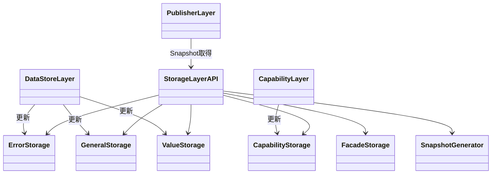
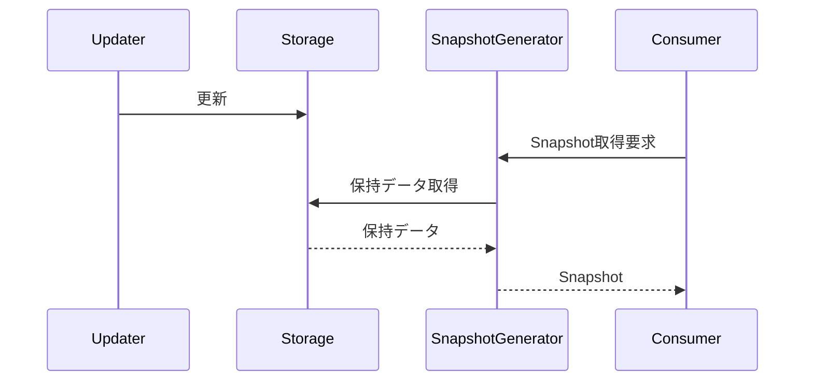
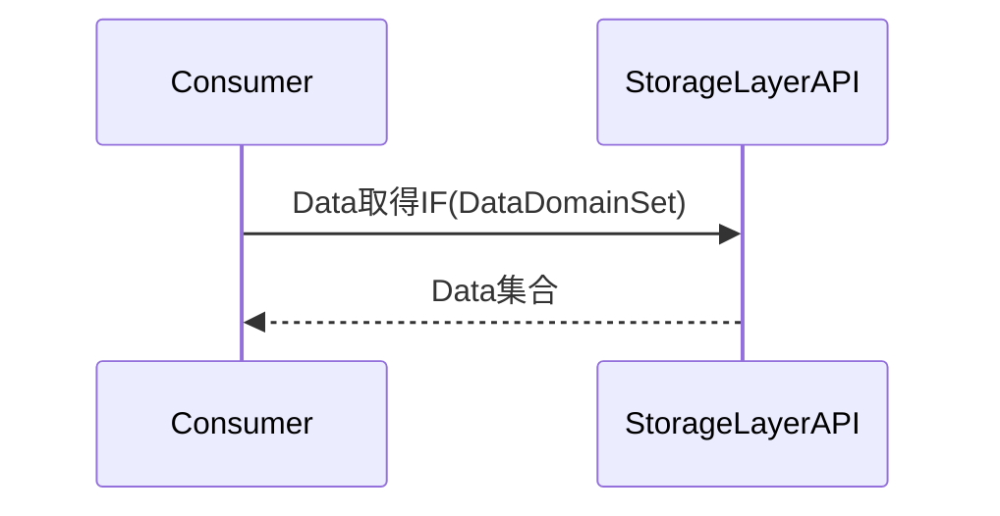
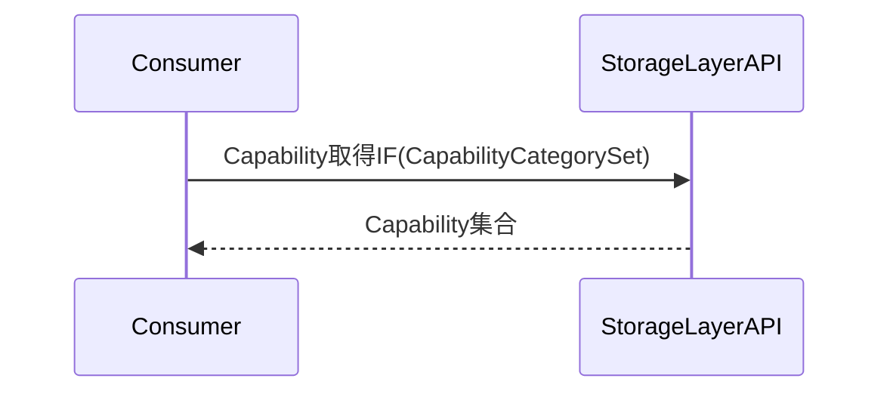
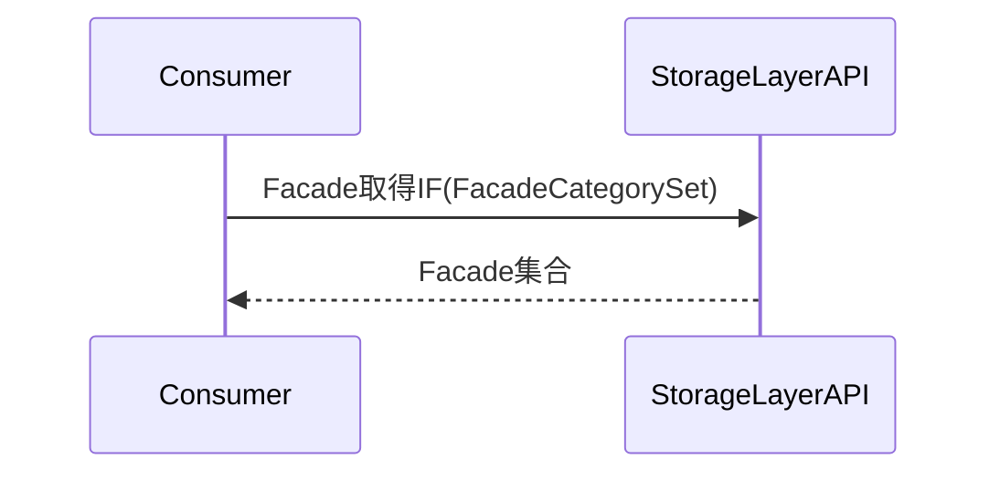
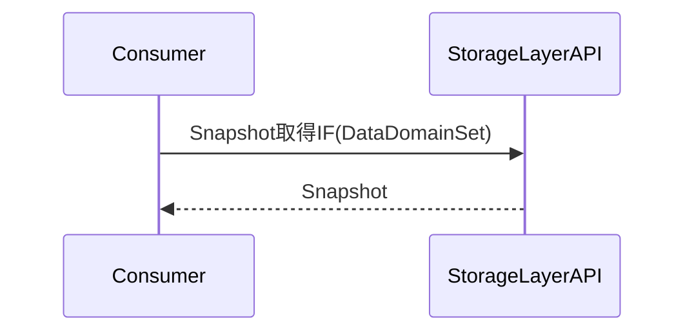

# 1. 表紙

## CONFIDENTIAL

| 項目 | 内容 |
|------|------|
| ドキュメント名 | StorageLayer モジュール仕様書 |
| バージョン | - |
| レイヤ | Storage Layer |
| 対象機種 | T.B.D |
| 作成 | ブラザー工業 システムプロセス開発部 開発3G |

# 2. 更新履歴

| バージョン | 更新日 | 更新者 | 内容 |
|------------|---------|---------|---------|
| 0.01 | T.B.D | 波多野 匡寛 | 初版作成 |

# 3. 目次

1. 表紙
2. 更新履歴
3. 目次
4. 概要
5. 用語集
6. 関連ドキュメント
7. 制約事項
8. 他のモジュールとの接続
9. 機能概要
10. IF仕様
11. コンフィグレーション仕様
12. 呼び出しシーケンス
13. 組み込み手順
14. 排他・整合性設計

---

# 4. 概要

## 4.1 本ドキュメントの目的

本ドキュメントは StorageLayer の仕様を規定する。

StorageLayer が保持する Data、Capability、Facade、および Snapshot の管理方針、提供する API、およびシステム内での位置づけを示す。

StorageLayer はシステムにおける情報の正本として機能し、一貫した情報取得機能を利用者へ提供する。

## 4.2 本ドキュメントの読み手

- StorageLayer を利用する Capability Layer 設計者
- StorageLayer を利用する Publisher Layer 設計者
- StorageLayerAPI を利用するアプリケーション設計者
- StorageLayer をシステムへ組み込む統合担当者
- Snapshot 機能を利用する設計者

## 4.3 本モジュールの位置づけ

StorageLayer はシステム内で利用される最新 Data、最新 Capability、最新 Facade、および Snapshot を保持する Layer である。

StorageLayer は以下を担当する。

- ErrorStorage 保持
- GeneralStorage 保持
- ValueStorage 保持
- CapabilityStorage 保持
- FacadeStorage 保持
- Snapshot 生成
- Snapshot 保持
- StorageLayerAPI 提供

StorageLayer は Single Source of Truth として振る舞い、最新 Data、最新 Capability、および最新 Facade の正本を管理する。

---

# 5. 用語集

## 5.1 制御階層に関する用語

| 用語 | 定義 |
|--------|--------|
| Data | システム内部で管理される各種情報 |
| DataDomain | データ管理単位 |
| DataDomainSet | DataDomain の集合 |
| Snapshot | 複数 DataDomain の情報を集約した状態情報 |
| Snapshot | StorageLayer が生成・保持する Snapshot |
| DataId | Data種別を識別する論理識別子 |
| ValueType | Data値型を表す識別情報 |
| DataDefinition | DataIdに対応するValueTypeおよびDataDomainを管理する定義情報 |

## 5.2 設計原則に関する用語

| 用語 | 定義 |
|--------|--------|
| Single Source of Truth | 情報の正本を単一箇所で管理する設計方針 |
| Snapshot整合性 | Snapshot取得時に複数DataDomainの整合性を保証すること |
| 単一時点整合性 | 複数データを同一時点の状態として取得できること |

## 5.3 モジュール固有用語

| 用語 | 定義 |
|--------|--------|
| StorageLayer | Data、Capability、Facade、および Snapshot を保持する Layer |
| StorageLayerAPI | 利用者へ情報取得機能を提供する API |
| ErrorStorage | 現在発生中の異常情報を保持する Storage |
| GeneralStorage | General系情報を保持する Storage |
| ValueStorage | 最新値情報を保持する Storage |
| CapabilityStorage | 最新 Capability を保持する Storage |
| FacadeStorage | 最新 Facade を保持する Storage |
| SnapshotGenerator | Snapshot 生成を担当するコンポーネント |

## 5.4 上位・下位レイヤに関する用語

| 用語 | 定義 |
|--------|--------|
| DataStore Layer | Storage 更新元となる Layer |
| Capability Layer | Capability を生成・更新する Layer |
| Publisher Layer | Snapshot 利用者となる Layer |
| 利用者 | StorageLayerAPI を利用して情報取得を行うコンポーネント |

## 5.5 モジュール構成区分に関する用語

| 用語 | 定義 |
|--------|--------|
| Storage | 情報保持責務を持つ構成要素 |
| StorageLayerAPI | 外部公開インターフェース |
| SnapshotGenerator | Snapshot生成責務を持つ構成要素 |

---

# 6. 関連ドキュメント

| # | 文書名 | 版 | 備考 |
|---|---------|-----|---------|
| 1 | Capability Layer仕様書 | T.B.D | Capability更新元 |
| 2 | Publisher Layer仕様書 | T.B.D | Snapshot利用先 |
| 3 | DataStore Layer仕様書 | T.B.D | Storage更新元 |

# 7. 制約事項

## 7.1 機能制約

StorageLayer は情報保持および情報提供責務を持つ Layer であり、以下の機能制約を持つ。

- StorageLayer は Data 受理を行わない。
- StorageLayer は Queue 管理を行わない。
- StorageLayer は Dispatcher 制御を行わない。
- StorageLayer は 更新通知を行わない。
- StorageLayer は Publisher 通知を行わない。
- StorageLayer は Subscription 管理を行わない。
- StorageLayer は Capability 生成を行わない。
- StorageLayer は Capability 差分判定を行わない。
- StorageLayer は Facade 生成を行わない。
- StorageLayer は Storage に保持された情報のみを提供する。
- Data の正本は StorageLayer が管理する。
- Capability の正本は CapabilityStorage が管理する。
- Facade の正本は FacadeStorage が管理する。
- 情報取得は StorageLayerAPI を介して行う。

## 7.2 前提条件

StorageLayer は以下の前提条件のもと動作する。

- DataStore Layer が Data 更新を実施すること。
- Capability Layer が CapabilityStorage 更新を実施すること。
- FacadeStorage が更新可能な構成であること。
- 利用者は StorageLayerAPI を利用して情報取得を行うこと。
- DataDefinition が事前定義されていること。
- CapabilityCategory が事前定義されていること。
- Snapshot 取得要求に必要な DataDomainSet が定義されていること。

## 7.3 呼び出し制約

StorageLayer を利用するコンポーネントは以下の制約に従うこと。

- Storage へ直接アクセスしてはならない。
- 利用者は StorageLayerAPI を経由して情報取得を行うこと。
- CapabilityStorage を更新可能なコンポーネントは Capability Layer のみとする。
- Snapshot 取得は StorageLayerAPI が提供する Snapshot取得IF を利用すること。
- 更新通知は DataStore Layer の責務とし、StorageLayer は通知を行わない。
- 排他制御および整合性保証の詳細は 14. 排他・整合性設計 に従うこと。
# 8. 他のモジュールとの接続

StorageLayer は情報保持および情報提供責務を持つ Layer として、他モジュールとの接続を行う。

StorageLayer は保持情報の正本として振る舞い、利用者へは StorageLayerAPI を介して情報を提供する。

## 8.1 想定される接続先

| # | 分類 | 接続先 | 接続方式 | 接続要否 | 用途 |
|---|---|---|---|---|---|
| 1 | 更新元 | DataStore Layer | Storage更新IF | 必須 | Data更新 |
| 2 | 更新元 | Capability Layer | Capability更新IF | 必須 | Capability更新 |
| 3 | 利用者 | Capability Layer | StorageLayerAPI | 必須 | 情報取得 |
| 4 | 利用者 | Publisher Layer | StorageLayerAPI | 必須 | 情報取得 |
| 5 | 利用者 | 利用者 | StorageLayerAPI | 任意 | 情報取得 |

## 8.2 接続方針

- 利用者は StorageLayerAPI のみへ依存する。
- 利用者は Storage へ直接アクセスしてはならない。
- StorageLayer は利用者へ保持中の情報のみを提供する。
- Snapshot取得は StorageLayerAPI を介して行う。
- StorageLayer は Publisher Layer へ通知を行わない。
- StorageLayer は DataStore Layer が実施する更新通知へ関与しない。
- StorageLayer は Capability 生成へ関与しない。
- StorageLayer は Facade 生成へ関与しない。
- 接続先コンポーネントは StorageLayer の内部構造へ依存してはならない。
- 接続先コンポーネントは StorageLayerAPI を契約IFとして利用する。

# 9. 機能概要

## 9.1 システム構造における位置づけ

StorageLayer は、システム内で利用される最新 Data、最新 Capability、最新 Facade、および Snapshot を保持する Layer である。

StorageLayer は DataStore Layer および Capability Layer から更新される情報を保持し、利用者へ StorageLayerAPI を介して情報を提供する。



## 9.2 内部処理モデル

StorageLayer は保持中データの管理および Snapshot の生成を行う。

Data 更新時は対応する Storage へ反映される。

利用者から Snapshot取得要求を受けた場合は、SnapshotGenerator が保持中データを集約して Snapshot を生成する。



## 9.3 責務

StorageLayer は以下の責務を持つ。

### 9.3.1 Storage構成と責務

| コンポーネント | 責務 |
|----------|----------|
| ErrorStorage | 現在発生中の異常情報を保持する。 |
| GeneralStorage | General系情報を保持する。 |
| ValueStorage | 最新値情報を保持する。 |
| CapabilityStorage | 最新Capabilityを保持する。 |
| FacadeStorage | 最新Facadeを保持する。 |
| SnapshotGenerator | 保持中データからSnapshotを生成する。 |
| StorageLayerAPI | 利用者へ情報取得機能を提供する。 |

### 9.3.2 情報保持

StorageLayer は以下の情報を保持する。

- Error情報
- General情報
- Value情報
- Capability情報
- Facade情報
- Snapshot

### 9.3.3 Snapshot生成

StorageLayer は保持中データを利用して Snapshot を生成する。

- Snapshot生成
- Snapshot保持
- Snapshot取得機能提供

### 9.3.4 情報提供

StorageLayerAPI を介して以下を提供する。

- Data取得
- Capability取得
- Facade取得
- Snapshot取得

### 9.3.5 正本管理

StorageLayer は Single Source of Truth として振る舞う。

- 最新Dataの正本管理
- 最新Capabilityの正本管理
- 最新Facadeの正本管理


## 9.4 非責務

StorageLayer は以下の責務を持たない。

- Dispatcher制御
- 更新通知
- Subscription管理
- Publisher通知
- Data差分判定
- Capability生成
- Capability差分判定
- Facade生成
- Facade生成差分判定

## 9.5 DataDefinition

### 9.5.1 概要

StorageLayerはシステム内で利用される
DataDefinitionの正本を管理する。

DataDefinitionは各Dataの識別子、値型、および所属DataDomainを定義する。

Data追加時はDataDefinitionへ定義を追加する。

新たな値型が必要となる場合はValueTypeへ型定義を追加する。

### 9.5.2 DataId

DataIdはData種別を識別する論理識別子である。

DataIdはシステム内で一意でなければならない。

Storageへの格納の際にIDを元に格納先の振り分けを行う。


### 9.5.3 ValueType

ValueTypeはData値型を表す識別情報である。
例：
```
- Scalar
- Enum
- Array
- Struct
```
ストリーム型は対象外とする。


### 9.5.4 DataDefinition

DataDefinition は
Data定義情報を表す。
```
struct DataDefinition
{
    DataId id;
    ValueType valueType;
    DataDomain domain;
};
```
DataDefinition は
システム内で利用するData定義の正本とする。

Data追加時は
DataDefinitionへ定義を追加する。

# 10. IF仕様

## 10.1 概要

本モジュールが提供する外部IFは StorageLayerAPI である。

利用者は StorageLayerAPI を介して保持中の Data、Capability、Facade、および Snapshot を取得する。

利用者は Storage へ直接アクセスしてはならない。

### 10.1.1 外部公開インターフェース一覧

| # | IF名 | 用途 | 責務 |
|---|---|---|---|
| 1 | Data取得IF | Data取得 | 保持中Dataの提供 |
| 2 | Capability取得IF | Capability取得 | 保持中Capabilityの提供 |
| 3 | Facade取得IF | Facade取得 | 保持中Facadeの提供 |
| 4 | Snapshot取得IF | Snapshot取得 | Snapshotの提供 |

### 10.1.2 外部利用インターフェース一覧

なし。

StorageLayer は利用者へ IF を提供する責務を持ち、外部IFへの依存は持たない。

### 10.1.3 外部公開型一覧

| # | 型名 | カテゴリ | 種別 | 用途 |
|---|---|---|---|---|
| 1 | DataDomain | Data | Identifier | Data取得対象指定 |
| 2 | DataDomainSet | Data | Collection | Data取得対象集合 |
| 3 | CapabilityCategory | Capability | Identifier | Capability取得対象指定 |
| 4 | CapabilityCategorySet | Capability | Collection | Capability取得対象集合 |
| 5 | FacadeCategory | Facade | Identifier | Facade取得対象指定 |
| 6 | FacadeCategorySet | Facade | Collection | Facade取得対象集合 |
| 7 | Snapshot | Snapshot | Structure | Snapshot取得結果 |
| 8 | Capability | Capability | Structure | Capability情報 |
| 9 | Facade | Facade | Structure | Facade情報 |

---

## 10.2 外部公開型

### 10.2.1 DataDomain

| 項目 | 内容 |
|------|------|
| 種類 | Identifier |
| 説明 | Data取得対象を識別する識別子 |
| 用途 | Data取得 |

### 10.2.2 DataDomainSet

| 項目 | 内容 |
|------|------|
| 種類 | Collection |
| 説明 | 複数DataDomainの集合 |
| 用途 | Data取得対象指定、Snapshot取得対象指定 |

### 10.2.3 CapabilityCategory

| 項目 | 内容 |
|------|------|
| 種類 | Identifier |
| 説明 | Capability取得対象を識別する識別子 |
| 用途 | Capability取得 |

### 10.2.4 CapabilityCategorySet

| 項目 | 内容 |
|------|------|
| 種類 | Collection |
| 説明 | 複数CapabilityCategoryの集合 |
| 用途 | Capability取得対象指定 |

### 10.2.5 FacadeCategory

| 項目 | 内容 |
|------|------|
| 種類 | Identifier |
| 説明 | Facade取得対象を識別する識別子 |
| 用途 | Facade取得 |

### 10.2.6 FacadeCategorySet

| 項目 | 内容 |
|------|------|
| 種類 | Collection |
| 説明 | 複数FacadeCategoryの集合 |
| 用途 | Facade取得対象指定 |

### 10.2.7 Snapshot

| 項目 | 内容 |
|------|------|
| 種類 | Structure |
| 説明 | StorageLayerが生成するSnapshot |
| 用途 | Snapshot取得結果 |

### 10.2.8 Capability

| 項目 | 内容 |
|------|------|
| 種類 | Structure |
| 説明 | Capability情報 |
| 用途 | Capability参照 |

### 10.2.9 Facade

| 項目 | 内容 |
|------|------|
| 種類 | Structure |
| 説明 | Facade情報 |
| 用途 | Facade参照 |

---

## 10.3 外部公開定数

なし。

---

## 10.4 外部公開関数／メソッド

### 10.4.1 Data取得IF

| 項目 | 内容 |
|------|------|
| IF名 | Data取得IF |
| 提供元 | StorageLayerAPI |
| 入力 | DataDomainSet |
| 出力 | Data集合(T.B.D) |
| 機能説明 | 指定されたDataDomain集合に対応する保持中Dataを取得する |

### 10.4.2 Capability取得IF

| 項目 | 内容 |
|------|------|
| IF名 | Capability取得IF |
| 提供元 | StorageLayerAPI |
| 入力 | CapabilityCategorySet |
| 出力 | Capability集合(T.B.D) |
| 機能説明 | 指定されたCapabilityCategory集合に対応するCapabilityを取得する |

### 10.4.3 Facade取得IF

| 項目 | 内容 |
|------|------|
| IF名 | Facade取得IF |
| 提供元 | StorageLayerAPI |
| 入力 | FacadeCategorySet |
| 出力 | Facade集合(T.B.D) |
| 機能説明 | 指定されたFacadeCategory集合に対応するFacadeを取得する |

### 10.4.4 Snapshot取得IF

| 項目 | 内容 |
|------|------|
| IF名 | Snapshot取得IF |
| 提供元 | StorageLayerAPI |
| 入力 | DataDomainSet |
| 出力 | Snapshot |
| 機能説明 | 指定されたDataDomain集合のSnapshotを取得する |
| 備考 | 整合性保証の詳細は14. 排他・整合性設計を参照 |

# 11. コンフィグレーション仕様

## 11.1 設計方針

StorageLayer は動的なコンフィグレーションによる動作変更を前提としない。

StorageLayer が管理する以下の識別子は静的定義とする。

- DataDefinition
- DataDomain
- CapabilityCategory
- FacadeCategory

保持対象データはコンフィグレーション対象ではなく、実行時データとして管理する。

---

## 11.2 StorageLayer構成

StorageLayer は以下の構成要素により構成される。

| 構成要素 | 用途 |
|-----------|-----------|
| ErrorStorage | Error情報保持 |
| GeneralStorage | General情報保持 |
| ValueStorage | Value情報保持 |
| CapabilityStorage | Capability情報保持 |
| FacadeStorage | Facade情報保持 |
| SnapshotGenerator | Snapshot生成 |
| StorageLayerAPI | 外部公開IF |

---

## 11.3 保持方針

StorageLayer は最新状態を保持する。

| 保持対象 | 保持方針 |
|-----------|-----------|
| Error情報 | 最新状態保持 |
| General情報 | 最新状態保持 |
| Value情報 | 最新状態保持 |
| Capability情報 | 最新状態保持 |
| Facade情報 | 最新状態保持 |
| Snapshot | 生成結果保持 |

StorageLayer は保持対象の正本として動作する。

---

## 11.4 制約事項

以下の構成情報は静的定義とする。

- DataDomain
- CapabilityCategory
- FacadeCategory

実行中に構成変更してはならない。

StorageLayer の構成要素は起動時に確定していること。

# 12. 呼び出しシーケンス

## 12.1 Data取得

利用者は Data取得IF を利用して保持中の Data を取得する。



---

## 12.2 Capability取得

利用者は Capability取得IF を利用して保持中の Capability を取得する。



---

## 12.3 Facade取得

利用者は Facade取得IF を利用して保持中の Facade を取得する。



---

## 12.4 Snapshot取得

利用者は Snapshot取得IF を利用して Snapshot を取得する。



# 13. 組み込み手順

## 13.1 構成要素

StorageLayer は以下の構成要素で構成される。

| 構成要素 | 必須 | 用途 |
|-----------|-----------|-----------|
| ErrorStorage | ○ | Error情報保持 |
| GeneralStorage | ○ | General情報保持 |
| ValueStorage | ○ | Value情報保持 |
| CapabilityStorage | ○ | Capability情報保持 |
| FacadeStorage | ○ | Facade情報保持 |
| SnapshotGenerator | ○ | Snapshot生成 |
| StorageLayerAPI | ○ | 外部公開IF |

---

## 13.2 組み込み方針

StorageLayer をシステムへ組み込む場合は、StorageLayerAPI を外部公開IFとして利用すること。

利用者は StorageLayerAPI を介して StorageLayer の機能を利用すること。

StorageLayer の内部構成要素は外部公開してはならない。

---

## 13.3 利用条件

StorageLayer を利用するコンポーネントは、用途に応じて以下のIFを利用すること。

- Data取得IF
- Capability取得IF
- Facade取得IF
- Snapshot取得IF

---

## 13.4 注意事項

- 利用者は StorageLayer の内部構造へ依存してはならない。
- 利用者は Storage へ直接アクセスしてはならない。
- StorageLayerAPI を唯一の公開IFとして利用すること。
- 排他制御および整合性保証の詳細は 14. 排他・整合性設計を参照すること。

# 14. 排他・整合性設計

## 14.1 排他マトリクス

| 対象A | 対象B | 結果 | 備考 |
|---------|---------|---------|---------|
| Error更新(同一DataDomain) | Error更新(同一DataDomain) | 排他 | ErrorStorage管理 |
| General更新(同一DataDomain) | General更新(同一DataDomain) | 排他 | GeneralStorage管理 |
| Value更新(同一DataDomain) | Value更新(同一DataDomain) | 排他 | ValueStorage管理 |
| Error更新(別DataDomain) | Error更新(別DataDomain) | 並列可 | DataDomain単位管理 |
| General更新(別DataDomain) | General更新(別DataDomain) | 並列可 | DataDomain単位管理 |
| Value更新(別DataDomain) | Value更新(別DataDomain) | 並列可 | DataDomain単位管理 |
| Capability更新(同一Category) | Capability更新(同一Category) | 排他 | CapabilityStorage管理 |
| Capability更新(別Category) | Capability更新(別Category) | 並列可 | CapabilityCategory単位管理 |
| Facade更新(同一Category) | Facade更新(同一Category) | 排他 | FacadeStorage管理 |
| Facade更新(別Category) | Facade更新(別Category) | 並列可 | FacadeCategory単位管理 |

## 14.2 整合性保証

| 項目 | 保証内容 |
|--------|--------|
| Snapshot取得 | 単一時点整合性を保証する |

## 14.3 設計方針

- 各Storageは自身の排他制御を管理する。
- ErrorStorage、GeneralStorage、ValueStorageは DataDomain 単位で排他制御を行う。
- CapabilityStorage は CapabilityCategory 単位で排他制御を行う。
- FacadeStorage は FacadeCategory 単位で排他制御を行う。
- Snapshot取得時は単一時点整合性を保証する。