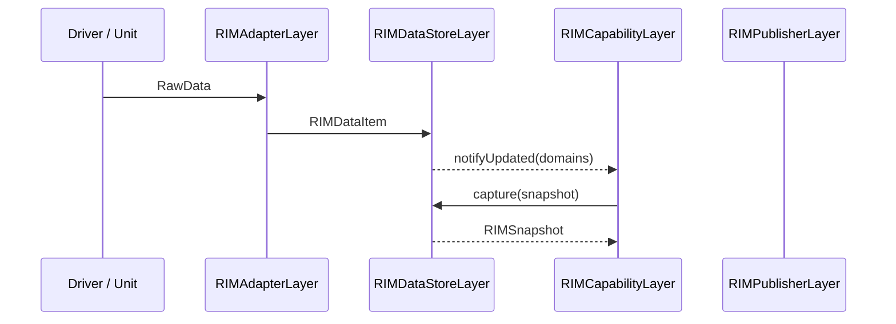
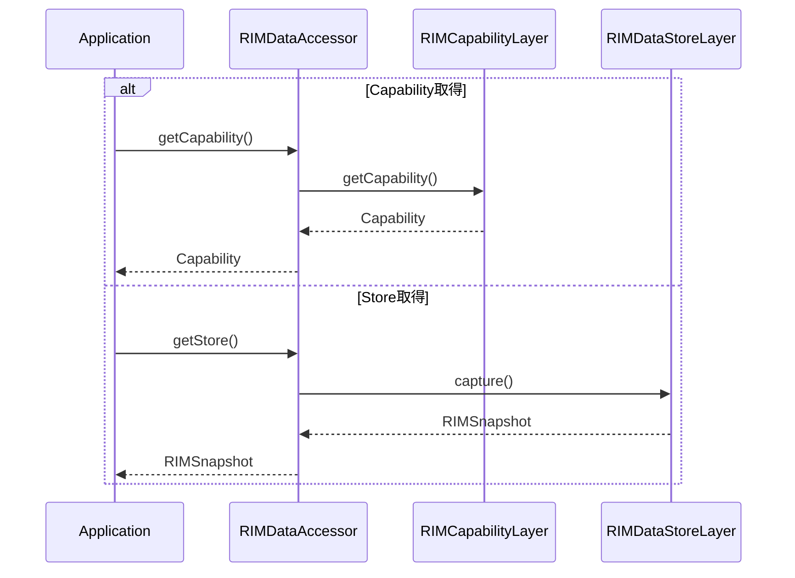
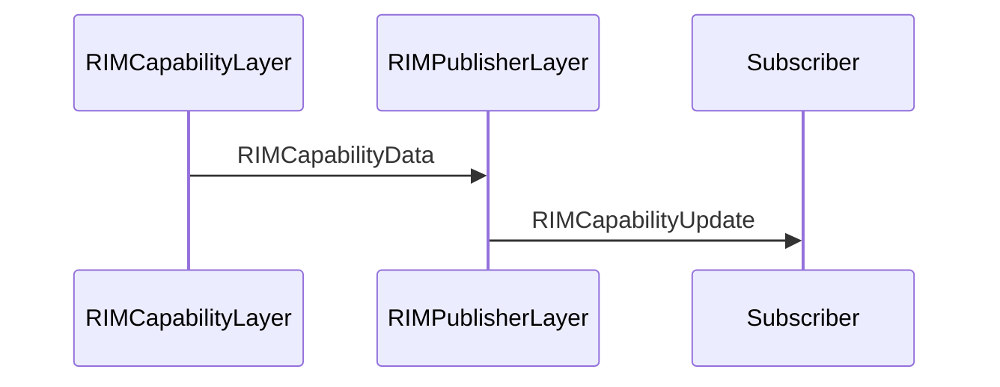
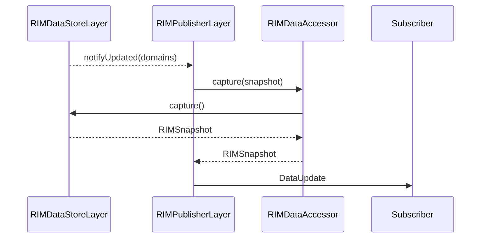
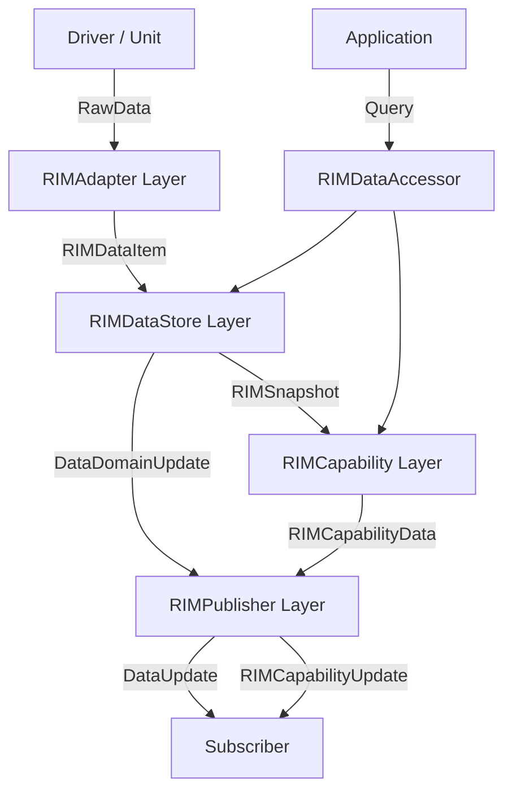
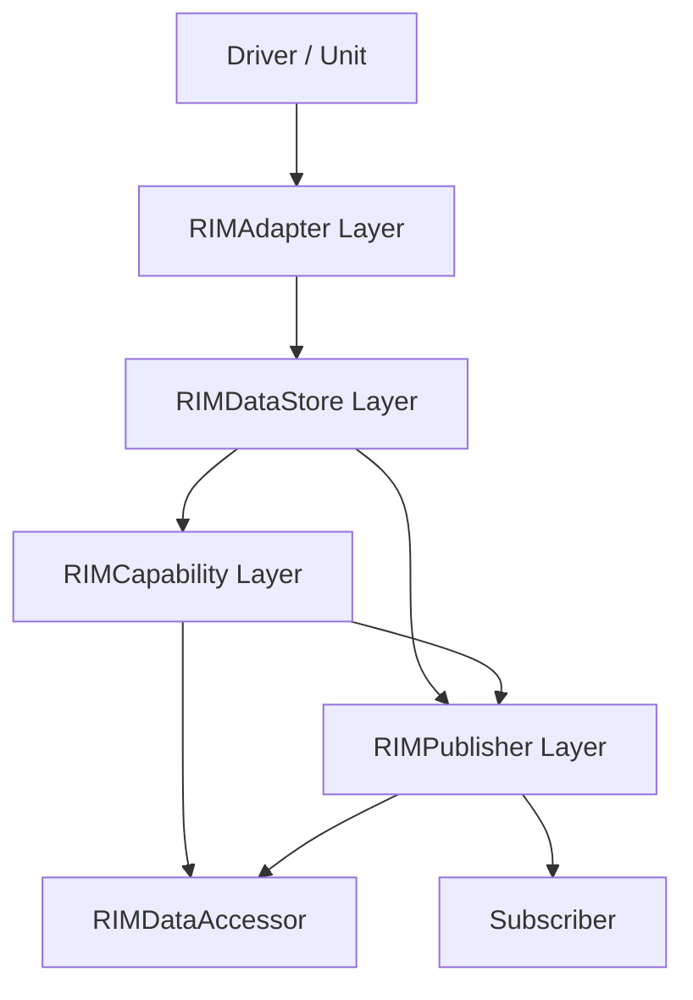

# 全体仕様設計書
## 1. ブロック図
ブロック図.drawio参照

---

## 2. レイヤ間シーケンス図
### 2.1 データ入力

入力種別として
- Value
- Error
- General

を扱う。

入力データはDataStoreへ反映され、
更新通知を契機としてCapabilityが再評価される。

---

### 2.2 Query参照

ApplicationはCapabilityまたはStoreを
RIMDataAccessor経由で取得する。

---

### 2.3 Capability通知

Subscriberの購読条件に応じて
Capability通知を行う。

通知契機は変更通知または周期通知とする。

---

### 2.4 Data通知

Subscriberの購読条件に応じて
Data通知を行う。

PublisherはDataを保持せず、
通知生成時にDataAccessor経由で
DataStoreから取得する。

通知契機は変更通知または周期通知とする。

---

## 3.アーキテクチャ共通用語集

### 3.1 Layer

| 用語 | 説明 |
|--------|--------|
| RIMAdapter Layer | 外部入力をシステム内部形式へ正規化するLayer |
| RIMDataStore Layer | システム内データの正本を保持するLayer |
| RIMCapability Layer | Dataの意味解釈を行いCapabilityを生成するLayer |
| RIMPublisher Layer | CapabilityおよびDataをSubscriberへ通知するLayer |
| RIMDataAccessor | CapabilityおよびStoreの参照機能を提供するコンポーネント |

---

### 3.2 外部コンポーネント

| 用語 | 説明 |
|--------|--------|
| Driver | デバイス固有処理を担当し、意味解釈済みデータをAdapter Layerへ通知するコンポーネント |
| Unit | Driverと同様に意味解釈済みデータをAdapter Layerへ通知するコンポーネント |
| Subscriber | Publisher Layerから通知を受けるコンポーネント |
| Application | RIMDataAccessorを利用する上位アプリケーション |
| UI | RIMDataAccessorまたはPublisher Layerを利用する画面コンポーネント |
| External Service | RIMDataAccessorまたはPublisher Layerを利用する外部システム |

---

### 3.3 共通データモデル

| 用語 | 説明 |
|--------|--------|
| RIMDataId | データ種別を識別する識別子 |
| RIMContext | データに付与される補足情報 |
| RawValue | 外部コンポーネントから受信した未変換データ |
| Value | システム内部で利用する標準化済みデータ |
| RawData | Adapter Layerが受理する入力契約データ |
| RIMDataItem | システム内部で利用する標準データモデル |
| DataDomain | Store内の論理的な管理単位 |
| DataDomainSet | DataDomainの集合 |
| RIMSnapshot | ある時点のStore状態を表現した読み取り専用データ |
| Capability | Dataから導出される意味を持った状態情報 |
| CapabilityCategory | Capabilityの分類識別子 |

---

### 3.4 Layer間インターフェース

| インターフェース | 提供元 | 利用先 | 役割 |
|--------|--------|--------|--------|
| IRIMAdapterPort | RIMAdapter Layer | Driver / Unit | Adapterへの入力IF |
| IRIMDataStoreSink | RIMDataStore Layer | RIMAdapter Layer | DataStoreへの入力IF |
| IAggregateRIMSnapshotReader | RIMDataStore Layer | RIMCapability Layer / RIMDataAccessor | RIMSnapshot取得IF |
| IRIMStoreUpdateNotifier | RIMDataStore Layer | RIMCapability Layer / RIMPublisher Layer | Store更新通知IF |
| IRIMPublisher | RIMPublisher Layer | RIMCapability Layer | Capability通知IF |
| IRIMCapabilityProvider | RIMCapability Layer | RIMDataAccessor | RIMCapability取得IF |

---

### 3.5 RIMDataStore Layer関連

| 用語 | 説明 |
|--------|--------|
| Store | RIMDataStore Layer内でDataを保持するコンポーネント |
| ErrorStore | Error系データを保持するStore |
| GeneralStore | General系データを保持するStore |
| ValueStore | Value系データを保持するStore |
| ErrorQueue | Errorを保持するQueue |
| GeneralQueue | Generalを保持するQueue |
| ValueBuffer | Valueを保持するBuffer |

---

### 3.6 RIMCapability Layer関連

| 用語 | 説明 |
|--------|--------|
| CapabilityRule | RIMSnapshotからCapabilityを算出するルール |
| CapabilityBuilder | CapabilityRuleを実行してCapabilityを生成するコンポーネント |
| CapabilityDiffChecker | Capability変更有無を判定するコンポーネント |
| CapabilityPriority | Publisherへの通知優先度 |
| CapabilityPriorityChecker | Capabilityから通知優先度を判定するコンポーネント |
| RIMCapabilityData | Publisher Layerへ通知するためのCapability情報パッケージ |

---

### 3.7 RIMPublisher Layer関連

| 用語 | 説明 |
|--------|--------|
| RIMCapabilityData | Capability LayerからPublisher Layerへ入力されるデータ |
| RIMCapabilityUpdate | Publisher LayerからSubscriberへ通知されるデータ |
| Subscription | SubscriberとPublisher Layerの購読契約 |
| SubscriptionInfo | Publisher Layerが保持する購読設定情報 |
| PeriodicCondition | 周期通知条件 |
| SubscriberMailbox | Subscriber専用の通知受信領域 |
| PublisherInputQueue | RIMCapability LayerとRIMPublisher Layerを接続するQueue |
| Change Notification | Capability変更を契機とした通知 |
| Periodic Notification | 周期条件に基づく通知 |

---

### 3.8 RIMDataAccessor関連

| 用語 | 説明 |
|--------|--------|
| CapabilityQueryService | Capability取得機能を提供するサービス |
| ConditionEvaluator | Capabilityを利用した条件評価機能 |
| StoreQueryService | Store取得機能を提供するサービス |
| Condition | 複数Capabilityを利用して評価される問い合わせ条件 |
| ConditionResult | Condition評価結果 |

---

### 3.9 入力分類

| 用語 | 説明 |
|--------|--------|
| Error | ErrorやWarning等の異常系入力 |
| General | 異常ではないが即時処理したい通知入力 |
| Value | 最新値のみが重要な入力 |

---

### 3.10 設計上の共通概念

| 用語 | 説明 |
|--------|--------|
| Single Source of Truth | システム内データの正本をRIMDataStore Layerのみが保持する考え方 |
| 正規化 | 外部形式を内部標準形式へ変換する処理 |
| 更新通知 | Store変更をRIMCapability Layerへ通知する処理 |
| 差分判定 | Capability変更有無を判定する処理 |
| 非同期通知 | Mailboxを介した通知方式 |
| 読み取り専用RIMSnapshot | RIMSnapshot生成後は変更不可能な状態で参照する方式 |
| 単一時点整合性 | RIMSnapshot取得時点の整合したデータ状態を保証する性質 |

---

### 3.11 Layer間受け渡しデータ一覧

---

#### 3.12 Layer間依存関係

